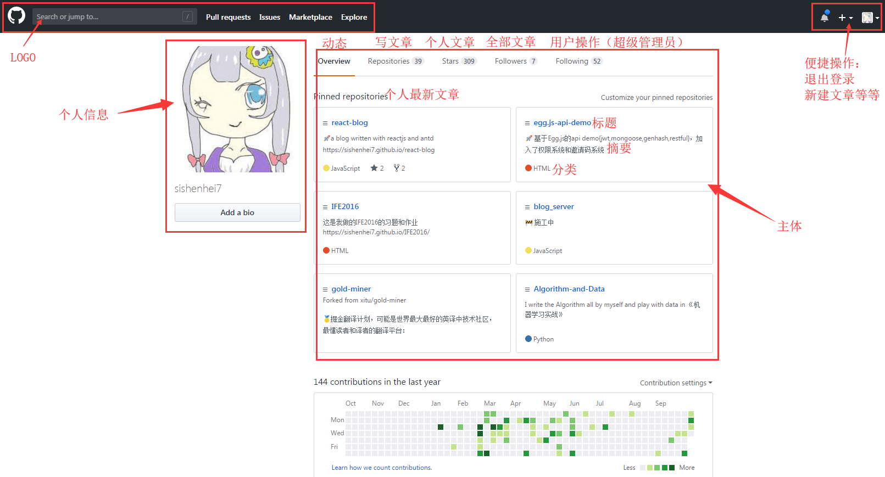

# react-management-system-for-egg.js

react写的后台管理系统，与[egg.js-demo](https://github.com/sishenhei7/egg.js-api-demo)配合

## TODO

- [x] react中使用less
- [x] antd按需加载
- [x] 界面草图
- [ ] 写界面

## 界面草图

灵感来源：github的界面设计。后台管理系统不需要太多炫酷的东西，简洁为好，个人有点烦那种左边导航的界面。而github其实就相当于一个仓库后台管理系统，界面扩展性也很强，所以决定仿照github的界面了。示例如下：

